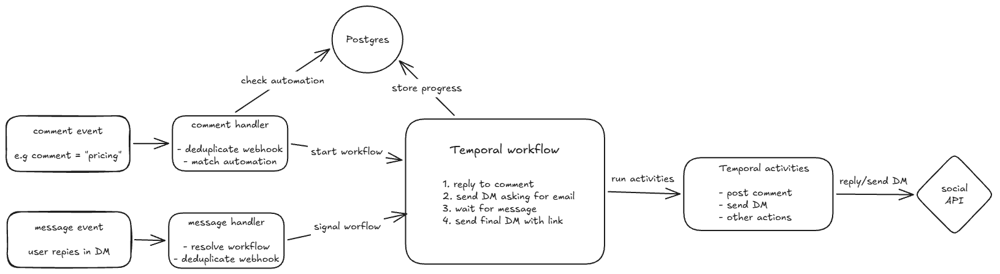

# Blotato Take Home

Small prototype of a backend for comment-triggered social media automations.

The example implemented here is:

1. user comments `pricing`
2. reply to the comment
3. send a DM asking for an email
4. wait for the user to respond
5. send another DM with a link

The main thing I wanted to model is the automation execution itself, especially the long-running `wait for message` step and failure/retry behavior around it.

## Architecture



Postgres stores application data such as automation definitions and processed webhook ids.

Temporal owns the execution state of running automations.

Social API calls are made through Temporal Activities (without Temporal it could be done via queue + workers).

## Automation model

Automations are stored as a trigger and a list of steps.

Example:

```json
{
  "trigger": {
    "type": "comment_created",
    "conditions": [
      {
        "field": "text",
        "operator": "equals",
        "value": "pricing"
      }
    ]
  },
  "steps": [
    {
      "type": "reply_to_comment",
      "text": "Sent you a DM!"
    },
    {
      "type": "send_dm",
      "text": "What's your email address?"
    },
    {
      "type": "wait_for_message",
      "validator": "email"
    },
    {
      "type": "send_dm",
      "text": "Thanks! Here's your link: https://example.com"
    }
  ]
}
```

For this case I used a simple ordered list of steps instead of a graph.

It is enough for this automation and still leaves room to add more step types later.

If the product needed branching, loops or more complex dependencies, this model could be extended or replaced with a graph representation.

Definitions are stored as JSONB in Postgres so adding new trigger/step types does not require changing the relational schema every time.

## Execution flow

When a comment event arrives:

```text
comment webhook
      │
      ▼
deduplicate event
      │
      ▼
find matching automation
      │
      ▼
start Temporal workflow
      │
      ├── reply to comment
      │
      ├── send DM
      │
      ▼
wait_for_message
```

`wait_for_message` does not keep a worker running.

The workflow waits durably inside Temporal.

When the user sends a message:

```text
message webhook
      │
      ▼
find workflow
      │
      ▼
send Temporal signal
      │
      ▼
workflow resumes
      │
      ▼
send final DM
```

[more detailed sequence diagram](https://sequencediagram.org/index.html#initialData=C4S2BsFMAIAUCcQGMQDsDm0kHsC2vJVhoBDAV2DxNG1WgDNxsB3AKFYAcT5QUujoAZWwoS4OOGr1s8XJ268Q-YgEFYASVYATaiQBGJAM4xY2Q8HTxIh+T2RKSAgCqRcHGWNuLl0AOoyAa0h4L3sfYVFxNU1WCJAxCSkZXABaAD5ogC4sPAIiADokK2pILWgACkh89HzoACIORBQMOoBKVmj003NLa2zgeABPAFluAIQRa2MtSoA3QmB1LXbuiytDFPSshhB4c2gtSHAQeaGKw60yDmOkahBado6NLrM1vugmEjLCfSgy8kouDutBsq16Gy2GmyAKoNDoQOASAAFmhMA0mqi6uxOmkXG4POBsuYFNBmIFGCxyjh8AslgAaaBkYzwenQcyQDiGR549zwMTpfzwILwbLwMh0KzXQYAfUo0upeWIJCQoFmYEGrEFwvScQS20l4EG9UEC2gg2wZFI0AAIsMAIRY3VRZ4CwLBIlkJBIKaat3wTa41y8sTQlUndU5NxQYCldg8gmuoXu6BiujGVBaaVaXCkMNq4AarXBHUieLO9TZW31XxI6gAckMZot8GgrhIIHEXy060MAH5HaW9S60kWRWzPd7DDZRwH43zCbnVRHqddIDGtOwALybyQx+Db9hOxLAaSySEV6AEKckdBVKzek6lbJ1RzdyAgAACkAAHiQo1VqSxHEwXWfohlGIUJknaY5lpZZWBA6wA22ehdn2Q5jlOI1yguK4bmBVBHiedR0jnEM2RAdBUASK9DBvSAACVIAfeYZgaYJDFoL9f3-Qo8DaOMgwTEc-VFcU2UITNs0XcMC19JN-TSI9tirOonFrVAAkMO1oAACWCSAGybMgW2OTTsnySyB0iaBOkTYUPS9H0Z1IoT51DJcC0jVd11YIA)

Incoming messages are passed to the workflow using a Temporal Signal.

The workflow keeps received messages in its state, so a message is also safe if it arrives slightly before execution reaches the wait step.

## Why Temporal

The main reason for using Temporal is the `wait for message` part.

An automation may wait seconds, hours or days for an external event. During that time it should survive worker restarts, deployments and other failures.

Without Temporal I would need to implement and maintain things like:

* persisted execution state
* workflow resumption
* retry scheduling
* long-running timers/waits
* concurrency around resuming executions
* recovery after worker failures

These are not really part of the product itself, so I would rather use existing infrastructure for them, especially in a startup.

Similar to using Postgres instead of building a database.

Postgres is still used for product/application state. Temporal is only responsible for workflow execution.

> Without Temporal I would persist `execution_id`/`current_step`/`status`, register waiting subscriptions (new table) in Postgres, enqueue runnable steps, and resume executions from matching inbound events.
> That design is also reasonable. I chose Temporal here because durable waiting and retries are core requirements and are already provided by it.

## Data model

The prototype has two application tables.

### `automations`

Stores:

```text
id
version
definition
enabled
```

`definition` contains the trigger and steps as JSONB.

The workflow receives a snapshot of the steps when it starts, so an already running workflow is not affected if the automation is changed later.

`enabled` could also be named `status` to support more states (e.g. `active`, `archived`, `deprecated`, etc).

### `processed_events`

Stores:

```text
platform
external_event_id
created_at
```

The `(platform, external_event_id)` pair is unique.

Social webhooks may be delivered multiple times, so this prevents the same event from starting an automation more than once.

Temporal itself stores the state/history of workflow executions, so I don't duplicate that state in Postgres.

I'm assuming `external_event_id` exists, otherwise some other column would be used for deduplication, e.g. `comment_id` in this case.

## Production architecture

In the prototype I store processed event ids in Postgres and route events directly to Temporal.

In production I would likely introduce an asynchronous layer between event ingestion and execution.

My first choice would be a transactional outbox (or a queue fed by it, both would work just fine), because it solves the Postgres → Temporal handoff problem without requiring a full event bus from day one.

If the system later needed multiple independent consumers, replay, or broader event-driven integrations, I would evolve that into a proper event bus.

## Reliability and concurrency

### Duplicate webhook delivery

Incoming events are deduplicated using the provider event id before matching automations.

The workflow id is also deterministic:

```text
automation:{automationId}:comment:{commentId}
```

so the same automation/comment pair has a stable workflow identity.

### Waiting for messages

A workflow is not tied to a running Node process while waiting.

Temporal stores its state and resumes it after the `messageReceived` signal arrives.

### Activity retries

Calls to the social API happen in Temporal Activities.

Activities have a retry policy for temporary failures.

This does not automatically make external side effects exactly-once.

For example, the platform may accept a DM but the response can be lost, causing the Activity to retry and possibly send it again.

In production I would use a stable idempotency key when supported by the provider, or keep an outbound action record on our side.

### Postgres -> Temporal handoff

There is one intentional reliability gap in this prototype.

Currently the flow is:

```text
mark webhook as processed
        │
        ▼
start Temporal workflow
```

Those two operations are not atomic.

If the process crashes between them, the event is already considered processed but the workflow was never started.

In production I would most likely use a `transactional outbox` pattern:

```text
Postgres transaction

  store processed event
  store workflow-start request

        │
        ▼
     commit
        │
        ▼
outbox worker starts Temporal workflow
```

The outbox worker can retry safely because the workflow id is deterministic.

I did not implement it here because it would add quite a bit of code without changing the main automation model - it's a prototype after all, I was focusing on showing the flow.

### Message correlation

Another simplification is that incoming message events already contain the Temporal `workflowId`.

A real social platform obviously does not know our workflow id.

In production I would resolve something like:

```text
social account
+ platform user
+ conversation/thread
        │
        ▼
active waiting automation
        │
        ▼
workflow id
```

and then signal the correct workflow.

That routing layer is outside the prototype.

## Other simplifications

The implementation is intentionally small.

For example:

* only the first matching automation runs
* only one trigger condition/operator is implemented
* email validation always succeeds
* social API calls are mocked/logged
* message-to-workflow correlation is assumed to happen upstream
* there is no UI
* there is no authentication or webhook signature validation
* there is no rate limiting
* there is only a happy-path workflow test

These are mostly separate from the execution model I wanted to demonstrate.

## Running locally

Assuming Docker is installed.

The repository includes Postgres, Temporal, the API and the Temporal worker.

To run the example flow with docker compose:

```bash
./scripts/demo.sh
```

The demo sends a `pricing` comment and then a fake email response.

The workflow test uses Temporal's test environment and mocked Activities.

It verifies the happy path:

```text
reply to comment
send first DM
wait
receive signal
send final DM
complete
```

If you'd like to start the whole stack:

```bash
docker compose up --build
```


## AI usage

I designed the architecture and made the implementation/trade-off decisions myself.

I had heard about Temporal before and thought it was a good fit for this type of durable workflow, but I had not worked with it directly before this take-home.

I used AI mainly as a coding assistant, especially to help me with the Temporal SDK, generate some boilerplate, discuss design trade-offs, review the implementation and help with docs.

